  

## 📊 GitHub Stats & Trophies

  
  

  

  

  

## 🛠️ Languages & Tools

> ## Programming Languages

   

> ## Frontend

     

> ## Backend

  

> ## Database

 

> ## Tools

   

  

## 🔗 Connect with Me

   

<picture>
  <source media="(prefers-color-scheme: dark)" srcset="https://raw.githubusercontent.com/abozanona/abozanona/output/pacman-contribution-graph-dark.svg">
  <source media="(prefers-color-scheme: light)" srcset="https://raw.githubusercontent.com/abozanona/abozanona/output/pacman-contribution-graph.svg">
  
</picture>

