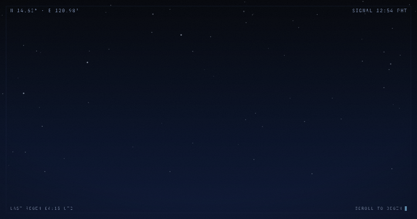
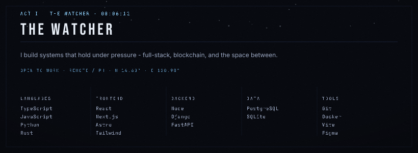
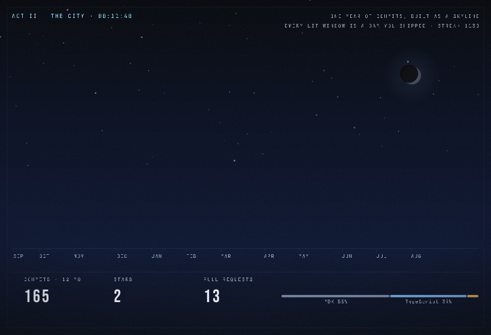
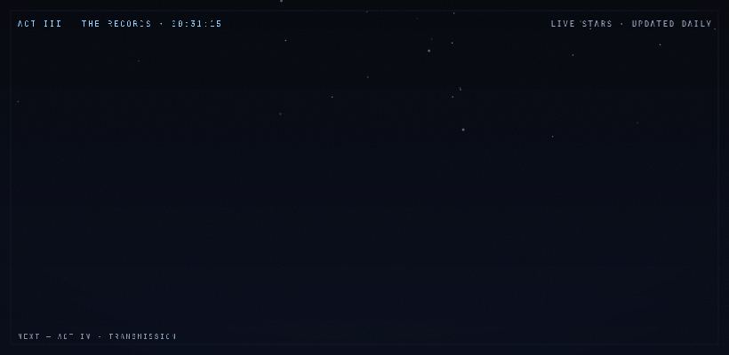
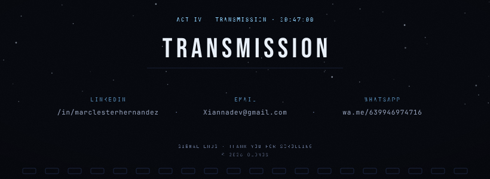

<!-- Night Signal — every artboard is generated from live GitHub data. See DESIGN.md. -->

  <picture>
    <source media="(max-width: 600px)" srcset="assets/act0-title-m.svg" />
    
  </picture>

  
    I · <a href="#act-i--the-watcher">The Watcher</a> &nbsp;·&nbsp;
    II · <a href="#act-ii--the-city">The City</a> &nbsp;·&nbsp;
    III · <a href="#act-iii--the-records">The Records</a> &nbsp;·&nbsp;
    IV · <a href="#act-iv--transmission">Transmission</a>
  

  <picture>
    <source media="(max-width: 600px)" srcset="assets/divider-m.svg" />
    
  </picture>

## Act I — The Watcher

  <picture>
    <source media="(max-width: 600px)" srcset="assets/act1-watcher-m.svg" />
    
  </picture>

I build systems that hold under pressure — full-stack, blockchain, and the space
between. Currently open to work, remote from the Philippines.

  
Equipment manifest

   

  | | |
  |---|---|
  | Languages | TypeScript · JavaScript · Python · Rust |
  | Frontend | React · Next.js · Astro · Tailwind |
  | Backend | Node · Django · FastAPI |
  | Data | PostgreSQL · SQLite |
  | Tools | Git · Docker · Vite · Figma |

  <picture>
    <source media="(max-width: 600px)" srcset="assets/divider-m.svg" />
    
  </picture>

## Act II — The City

  <picture>
    <source media="(max-width: 600px)" srcset="assets/act2-city-m.svg" />
    
  </picture>

A year of commits, built as a skyline. Every tower is a week; every lit window
is a day that shipped; the beacon sits on the newest week and the caption carries
the live streak. Towers, readouts and the language bar refresh daily from the
GitHub API.

  <picture>
    <source media="(max-width: 600px)" srcset="assets/divider-m.svg" />
    
  </picture>

## Act III — The Records

  <picture>
    <source media="(max-width: 600px)" srcset="assets/act3-records-m.svg" />
    
  </picture>

- **[Veritras](https://github.com/Oionos/Veritras)** — blockchain ledger ·
  supply-chain provenance, on-chain. Solidity, FastAPI, React.
- **[DesignVault](https://github.com/Oionos/DesignVault)** — design system ·
  30+ curated aesthetics with AI-ready prompts.
- **[Maghapon-Cafe](https://github.com/Oionos/Maghapon-Cafe)** — web ·
  a slow-coffee house, built in Astro.

  <picture>
    <source media="(max-width: 600px)" srcset="assets/divider-m.svg" />
    
  </picture>

## Act IV — Transmission

  <picture>
    <source media="(max-width: 600px)" srcset="assets/act4-transmission-m.svg" />
    
  </picture>

  <a href="https://www.linkedin.com/in/marclesterhernandez/">LinkedIn</a> &nbsp;·&nbsp;
  <a href="mailto:Xiannadev@gmail.com">Email</a> &nbsp;·&nbsp;
  <a href="https://wa.me/639946974716">WhatsApp</a>

---

  
    Night Signal · art regenerated daily from the GitHub API ·
    <a href="scripts/generate_profile.py">generator</a> ·
    <a href="DESIGN.md">design</a>
  

